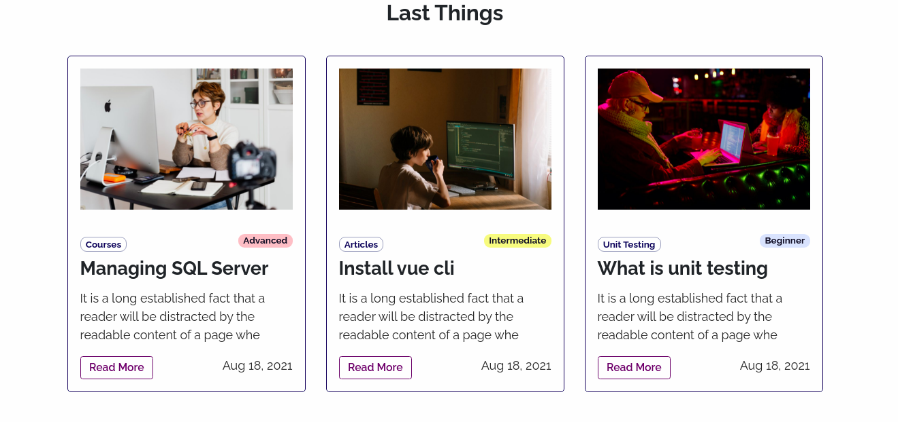

<p align="center">
  <a href="#">
    
  </a>
</p>
<p align="center">
  Platform from developers to developers thats help them to grow from baby steps in software development to Senior level, it contains huge bunch of resources from books, articles, youtube channels, free courses, developer tweets, free templates, open source projects and etc
</p>


## Some pages


<hr>

<hr/>


<hr/>


<hr/>


<hr/>


## Features

- **Add new Thing**
- **When you add new thing you can select level**
- **Single Page foreach thing with description click on card to access it**
- **Filter by Title, Category and Level of experience**. 
- **You can access anything directly by click on 🔗 Icon**
- **Auth System supported by [Auth0](https://auth0.com/)**
- **Profile page foreach logged in user with last things he created**
- **Pretty amazing alerts supported by [Sweetalert2](https://sweetalert2.github.io/)**
- **Fully Responsive supported by [Lazy-Kit](https://github.com/bootstrapbay/lazy-kit)**
- **404 Error Page**


## How to run app locally

1. Clone the repository

```bash
git clone https://github.com/idev-io/hashnode-hackathon.git
```

2. Change the working directory

```bash
cd hashnode hackathon
```

3. Create virtual environment

```bash
virtualenv env
```

4. Activate virtual environment

```bash
Mac & Linux -> source env/bin/activate
Windows -> .\env\Scripts\activate
```

5. Install modules

```bash
pip3 install -r requirements.txt
```

6. Create `.env` file in root

```bash
DJ_SECRET_KEY = Your Django Secret Key
DJ_DEBUG = True for Development | False for Production
APP_DOMAIN = Your Auth0 App Domain
APP_CLIENT_ID = Your Auth0 App Client ID
APP_CLIENT_SECRET = Your Auth0 Secret Key
```

7. Create tables

```bash
- python manage.py makemigrations
- python manage.py migrate
```

8. Run App

```bash
python manage.py runserver
```

9. Open [localhost:8000](http://localhost:8000/)

## Built with

- [Django](https://www.djangoproject.com/)
- [Auth0](https://auth0.com/)
- [Lazy-Kit](https://github.com/bootstrapbay/lazy-kit)


## License
License under the [MIT License](LICENSE).
